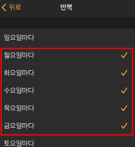
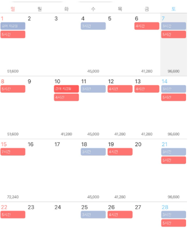

# 프로젝트 기획서

---

## 1. 알바 급여 계산기

### 한 줄 설명
아르바이트 급여를 손쉽게 계산하고 다양한 편의 기능을 제공하는 앱

---
## 2. 기존 앱 사용 시 불편했던 점

1. 요일별 급여 설정이 어려움
2. 규칙적인 지출액을 별도로 계산해야 수입 확인 가능
3. 급여일까지 남은 날짜를 직접 세어야 함

---
## 3. 구현하고 싶은 기능
### 요일별 급여 설정
- 요일마다 다른 급여를 한 번에 지정 가능
- 기존 앱은 날짜별로만 급여를 설정해야 했음

### 급여 역산 계산기
- 목표 금액을 입력하면 필요한 근무 기간 자동 계산

### 지출 포함 급여 계산
- 교통비, 식비 등 근무일 지출을 반영한 실제 수입 계산

### 급여일까지 남은 기간 표시

### To-do 리스트
- 근무일에 꼭 해야 할 일을 기록

---
## 4. 필수 기능
### 달력 기능

### 달력에 표시될 라벨링
- 대타, 지각, 결근 등 근무 상태 표시

### 수당 설정
- 야간, 휴일, 연장 근무 수당 반영

### 급여 계산기
- 기본 급여 및 수당 포함 총액 계산

---
## 5. 선택 기능 (필수 아님)

### 알바 팁 게시판, 급여 질문 게시판
- 초보자를 위한 정보 공유 공간

### 월별 누적 급여 표시
- 지금까지 번 금액을 한 달 단위로 확인

---

## 6. 기대 효과

1. 급여 관리 효율성 향상
- 요일별 급여, 지출, 수당 등을 자동 반영해 실제 수입을 정확히 계산할 수 있음
2. 시간 절약
- 급여일까지 남은 기간, 목표 금액 달성 기간 등을 자동 계산해 직접 세거나 따로 기록할 필요 없음
3. 생활 관리 개선
- To-do 리스트와 달력 라벨링을 통해 근무 일정과 개인 할 일을 한눈에 관리 가능
4. 재정 계획 수립 용이  
- 지출 포함 계산으로 실제 순수익을 확인해 저축·소비 계획을 세우기 쉬움
5. 아르바이트 초보자 입문 장벽 낮추기
- 급여 계산기와 수당 설정 기능으로 복잡한 계산을 자동화
6. 정보 공유
- 팁·질문 게시판을 통해 경험 부족한 사용자들이 서로 도움을 받을 수 있음